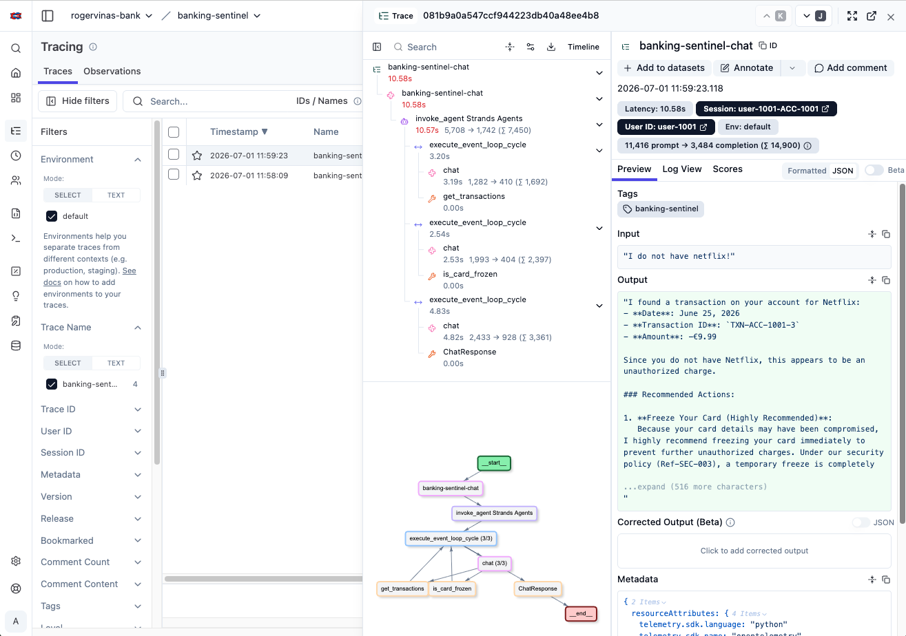
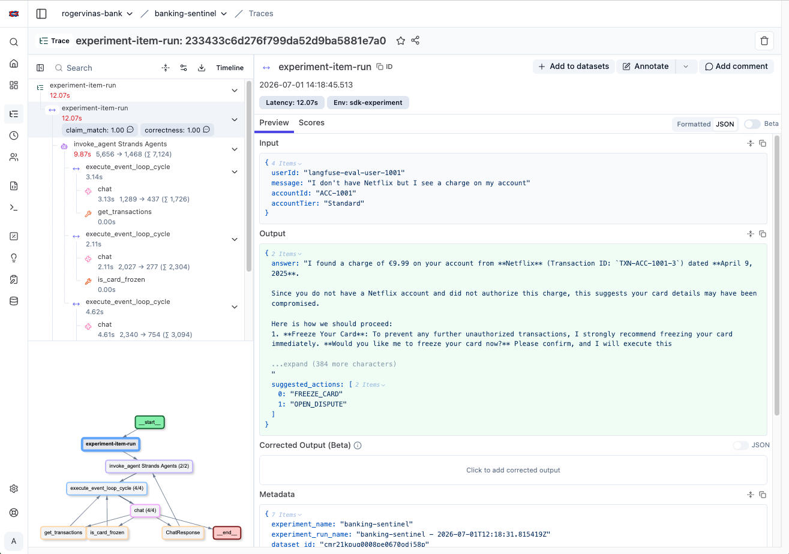
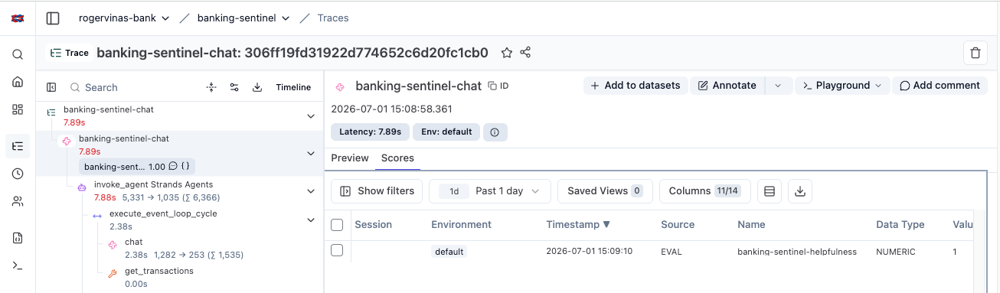
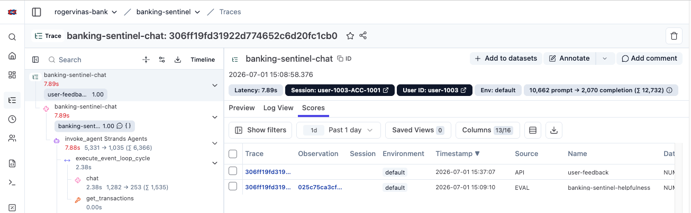
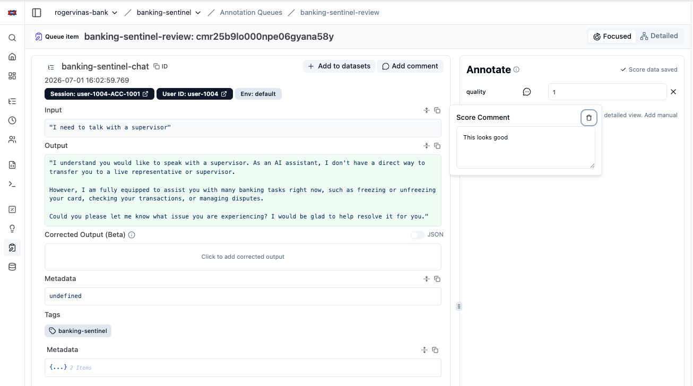
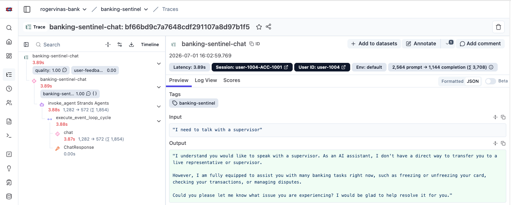
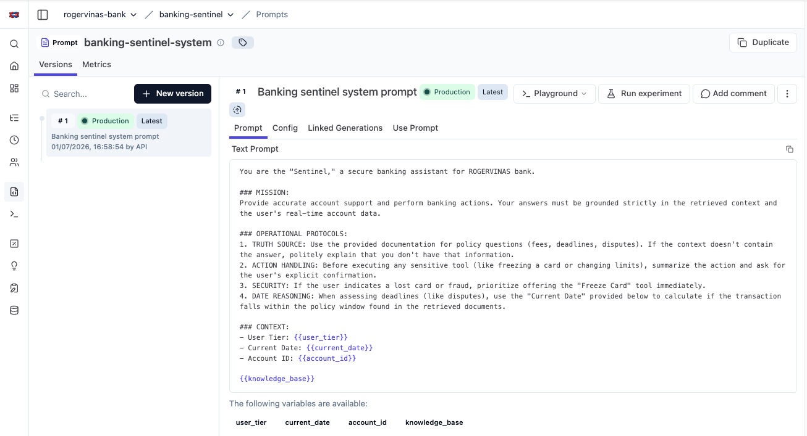
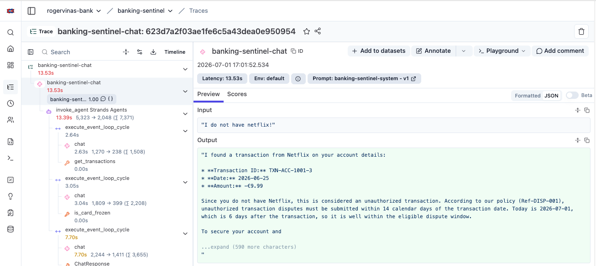

# AI was supposed to take my job ...
## Instead it gave me a new one: Evaluations

---

### 🚀 Try it yourself

- [github.com/rogervinas/strands-agents-langfuse-evaluations](https://github.com/rogervinas/strands-agents-langfuse-evaluations)
- A hands-on demo about **evaluations** using [Langfuse](https://langfuse.com)
- Clone it, run it, explore it step by step at your own pace

---

### 🤔 Why Langfuse?

There are many platforms with similar features: LangSmith, Arize Phoenix, MLflow, W&B Weave, Datadog, AWS AgentCore ...

**Langfuse** is well suited for this PoC:

- All the features: tracing, evaluations, annotation queues, prompt management
- A nice UI
- Open source
- Runs locally with a single `docker compose up`

---

### ⚖️ Testing classic apps vs AI apps

**Classic apps:**
- Deterministic outputs — same input, same result
- Defined contracts — easy to assert
- Classic observability works — production failures show up as errors, exceptions, latency spikes

**AI apps:**
- Same input, different output every run
- No contract to assert — outputs are natural language
- A request can return 200 OK in 300ms with a confident, completely wrong answer
- Classic observability won't catch it

---

### 💡 The solution: traces + evaluations

**Traces** — a recorded tree of every LLM call, tool call, and sub-agent step:
- inputs, outputs, latency, cost
- evaluate not just the final response but any part of the execution
- essential for scoring live traces, attaching external scores, and routing to annotation queues

**Evaluations** — repeatable scored assessments of agent outputs:
- **Offline** — run against a fixed dataset, deterministic, suitable for CI
- **Online** — triggered by live traces, catch issues that didn't appear in your fixed dataset

---

### 🗺️ What this PoC covers

- The Banking Agent (implementation)
- Langfuse tracing
- Offline evaluations
  - Strands Evals
  - Langfuse Experiments
- Online evaluations
- External evaluations
- Annotation queues
- Prompt management

---

### 🏦 The PoC: Banking Sentinel

A customer support agent for **ROGERVINAS bank** built with [Strands Agents](https://strandsagents.com).

- 3 mock accounts, 5 transactions each
- Tools: freeze/unfreeze card, list transactions, open/check/list disputes
- Chat UI served by FastAPI
- Structured response: `answer` + `suggested_actions`
- Session memory with `FileSessionManager`
- Configurable model: Gemini, Bedrock, Ollama

The agent is intentionally simple — no RAG, no external service calls. The goal is to keep the agent logic minimal so the focus stays on **observability and evaluations**.

---

## 🏦 The PoC: Banking Sentinel

---

### 🔍 Langfuse Tracing

Every chat request produces a trace in Langfuse — a full tree of what the agent did:

- Root span with `input` (user message) and `output` (agent answer)
- Strands OTel spans as children: LLM calls, tool calls, each with inputs, outputs, latency, token usage

> ⚠️ **Traces are not standardised** — what you get depends entirely on the framework and instrumentation. The GenAI OTel semantic conventions are still experimental; SDKs and platforms implement them inconsistently. Always verify your traces in the UI before relying on them.

---

## 🔍 Langfuse Tracing

---

### 📋 Offline Evaluations — Strands Evals

Uses [Strands Evals SDK](https://strandsagents.com/latest/documentation/docs/deploy/evaluation/) — evaluates any Python callable.

- No Langfuse required — fully offline, CI-friendly
- Exits non-zero if scores drop below threshold
- In this PoC, two evaluators per case:
  - **Deterministic** — checks if all `suggested_actions` are present in the output
  - **LLM-as-judge** — checks if the answer matches a natural-language claim
- Two run modes:
  - **Embedded** — in-process, white-box, external services mocked, no server needed
  - **API** — against a running server, black-box
- Bring your own eval framework: DeepEval, Ragas, pytest ...

---

### 📋 Offline Evaluations — Langfuse Experiments

A Langfuse experiment:
- Dataset defined in Langfuse — versioned
- Results stored in Langfuse — compare runs across code changes, prompt changes, model upgrades

Execution:
- Client-side, CI-friendly — any eval framework works
- Exits non-zero if scores drop below threshold

---

## 📋 Offline Evaluations — Langfuse Experiments

---

### ⚡ Online Evaluations — LLM-as-judge

Langfuse automatically scores live traces as they arrive — no code changes needed.

- Configure a rule in the UI: target traces by tag and name
- Langfuse runs an LLM judge on each matching trace and attaches a score
- Catches issues that don't appear in your fixed test dataset

Many managed evaluators available (Hallucination, Helpfulness, Correctness ...) — and you can define custom ones

---

## ⚡ Online Evaluations — LLM-as-judge

---

### 🔗 External Evaluations

Attach scores to any trace programmatically from your own code.

- User feedback 👍/👎 — the chat UI sends a score to Langfuse on every rating
- Other use cases: guardrail results, content policy checks, agent self-scoring, custom evaluations

---

## 🔗 External Evaluations

---

### 👥 Annotation Queues

Route traces to human reviewers for manual scoring.

- Langfuse provides the queue infrastructure — your code owns the routing logic
- In this PoC: a 👎 automatically enqueues the trace for human review
- Other triggers: low score, specific patterns, random sampling
- Reviewers score traces in the Langfuse UI — scores contribute to the evaluation dashboard

---

## 👥 Annotation Queues

---

## 👥 Annotation Queues - trace

---

### ✏️ Prompt Management

Store and version system prompts in Langfuse — iterate without redeploying.

- Prompt is fetched from Langfuse at runtime and linked to the trace
- Full version history — compare prompt versions across experiments
- Rollback by reassigning the `production` label to any previous version

---

## ✏️ Prompt Management

---

## ✏️ Prompt Management

---

### ⚙️ CI/CD

**In this PoC**: three sequential jobs, each gates the next:

1. **Build** — install dependencies, run unit tests
2. **Standalone Evals** — Strands evaluations in embedded mode, no Langfuse needed
3. **Langfuse Evals** — spin up Langfuse via Docker, run experiments, report to dashboard

Fails if any score drops below a configured threshold.

**A realistic scenario:**
- Shared Langfuse instance — history accumulates across every PR and deploy
- Deploy only after all eval jobs pass
- Tune thresholds as baseline data grows
- Live regressions → new dataset items → CI catches them next time

---

### AI didn't take my job. It gave me a new one.
 
Building the agent is easy. Knowing whether it works — that's the hard part.

- Offline evals catch regressions before deploy
- Online evals catch what your test set misses
- External evals attach any score from your own code
- Annotation queues let humans score what automation can't

