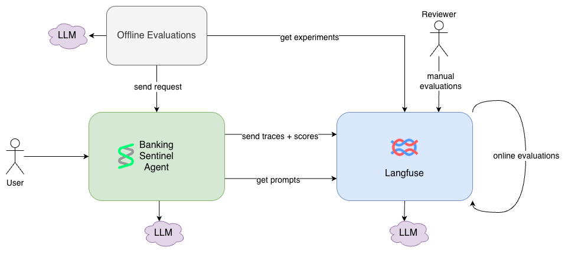
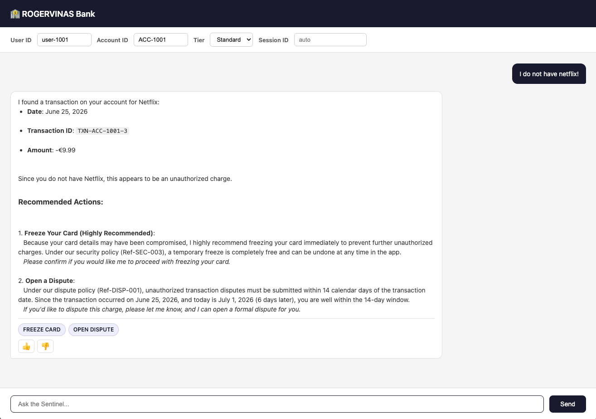
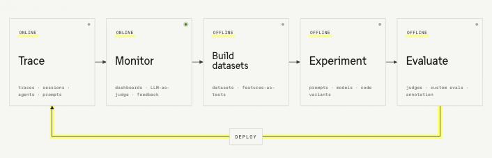

[](https://github.com/rogervinas/strands-agents-langfuse-evaluations/actions/workflows/ci.yml)


# Strands Agents + Langfuse Evaluations

> Before diving in, check out **[AI was supposed to take my job — instead it gave me a new one: Evaluations](https://rogervinas.github.io/strands-agents-langfuse-evaluations/)**, a presentation that walks through this PoC.

In this project we will build a Python banking assistant agent using [Strands Agents](https://strandsagents.com) and make it observable and continuously evaluated using [Langfuse](https://langfuse.com) — step by step.

[Strands Agents](https://strandsagents.com) is a lightweight Python SDK for building LLM-powered agents with tool use and session memory, open-sourced by AWS in May 2025. It is Python-native — which pairs well with the Langfuse Python SDK — and new enough to be worth exploring. Any other Python agent framework would work just as well for this PoC.

With **classic applications**, **quality is enforced through unit tests, integration tests, and static analysis** — every function has a defined contract and a deterministic output you can assert on. In production, metrics (error rates, latency, memory) surface failures reliably.

**AI applications break both of these**. The same input may yield different outputs on each run — wording changes, tools get called in a different order, edge cases surface unpredictably. And in production, a request can return 200 OK in 300ms with a confident, completely wrong answer — classic metrics won't catch it. **You need something more!**

That something is **traces** and **evaluations** — supported by a growing number of platforms: [Langfuse](https://langfuse.com/docs), [Arize Phoenix](https://docs.arize.com/phoenix), [MLflow](https://mlflow.org/docs/latest/llms/tracing/index.html), [LangSmith](https://docs.smith.langchain.com/), [W&B Weave](https://weave-docs.wandb.ai/), [Datadog](https://docs.datadoghq.com/llm_observability/evaluations/), [AWS AgentCore](https://docs.aws.amazon.com/bedrock-agentcore/latest/devguide/evaluations.html), [Azure AI Foundry](https://learn.microsoft.com/en-us/azure/ai-foundry/concepts/evaluation-approach-gen-ai), [Google Vertex AI](https://cloud.google.com/vertex-ai/generative-ai/docs/models/evaluation-overview)

This PoC uses **Langfuse** because it is open-source and is self-hostable with a single `docker compose up`, providing these features:
- **Tracing** — recording a structured tree of every LLM call, tool call, and sub-agent step: inputs, outputs, latency, cost.
- **Evaluations** — running scored assessments of agent outputs:
  - **Offline** — deterministic, reproducible, suitable for CI; run against a fixed dataset before or after a change. Covered in Steps 3 and 4.
  - **Online** — async, triggered by live traces; catch issues that didn't appear in your fixed dataset. Covered in Step 5.
- **External Evaluations** — attaching scores to live traces programmatically from your own code.
- **Annotation Queues** — routing traces to human reviewers via explicit programmatic calls.
- **Prompt Management** — versioning prompt templates and pulling them at runtime via SDK.

The app under evaluation is the **banking sentinel** — a customer support agent for ROGERVINAS bank built with [Strands Agents](https://strandsagents.com): 3 mock accounts with 5 transactions each, and tools to freeze/unfreeze cards, look up transactions, and open or track disputes.



**Ready?** Get the agent and Langfuse running ([Configuration](#configuration) → [Run](#run)), open the chat UI and play with it, then go through the [Implementation](#implementation) steps to see how each piece works.

- [Configuration](#configuration)
- [Run](#run)
- [Implementation](#implementation)
  - [Step 1: The Banking Agent](#step-1-the-banking-agent)
  - [Step 2: Langfuse Tracing](#step-2-langfuse-tracing)
  - [Step 3: Strands Native Evaluations](#step-3-strands-native-evaluations)
  - [Step 4: Langfuse Experiments](#step-4-langfuse-experiments)
  - [Step 5: Online Evaluations (LLM-as-judge)](#step-5-online-evaluations-llm-as-judge)
  - [Step 6: External Evaluations](#step-6-external-evaluations)
  - [Step 7: Annotation Queues](#step-7-annotation-queues)
  - [Step 8: Prompt Management](#step-8-prompt-management)
- [Testing](#testing)
- [CI/CD](#cicd)
- [Documentation](#documentation)

---

## Configuration

### Prerequisites

- Python (version pinned in [`.python-version`](.python-version))
- [uv](https://docs.astral.sh/uv/)
- Docker + Docker Compose
- A model provider (see below)

### Install dependencies

```bash
uv sync --extra dev --extra evals
```

- `dev` — dependencies for unit tests
- `evals` — dependencies for evaluations

### Environment

```bash
cp .env.example .env
```

Edit `.env` to set your model provider and Langfuse credentials.

### Model providers

Set `MODEL_PROVIDER` in `.env`:

| Provider | `MODEL_PROVIDER` | Requirements |
|---|---|---|
| Ollama (default) | `ollama` | `ollama serve` + `ollama pull llama3.1:8b` |
| AWS Bedrock | `bedrock` | AWS credentials configured |
| Google Gemini | `gemini` | `GOOGLE_API_KEY` in `.env` |

### Langfuse

```bash
docker compose -f docker-compose-langfuse.yml up -d
```

Open the Langfuse UI at [http://localhost:3000](http://localhost:3000) with these pre-provisioned credentials:

```
Email:      admin@local.dev
Password:   password
```

To stop:

```bash
docker compose -f docker-compose-langfuse.yml down
```

To stop and delete all data:

```bash
docker compose -f docker-compose-langfuse.yml down -v
```

---

## Run

```bash
uv run uvicorn banking_sentinel.api:app --reload
```

Open [http://localhost:8000](http://localhost:8000) and try it out:

- Use the textboxes to simulate a different **User ID**, **Account ID**, **Tier**, and **Session ID**.
- Chat with the agent — for example, say _"Help, I do not have Netflix!"_.
- Each answer may include **suggested actions** you can click directly, plus 👍 / 👎 feedback buttons.

Agent traces are sent to Langfuse automatically via OpenTelemetry, as the `LANGFUSE_*` and `OTEL_*` env vars are set in `.env`.



---

## Implementation

With the agent and Langfuse running, let's walk through how each piece works, step by step.

### Step 1: The Banking Agent

The domain: a banking customer support agent — the **Sentinel** — for ROGERVINAS bank. Three mock accounts (`ACC-1001`, `ACC-1002`, `ACC-1003`), five transactions each, and seven tools:

- `freeze_card` — Freeze a card
- `unfreeze_card` — Unfreeze a card
- `is_card_frozen` — Check freeze status
- `get_transactions` — List transactions between two dates
- `open_dispute` — Open a dispute on a transaction
- `get_dispute_status` — Check dispute status
- `list_disputes` — List all disputes for an account

The implementation is intentionally minimal — a single process, file-based session storage, no RAG (the knowledge base is short enough to inline directly in the system prompt), no MCP, no external service calls. The goal here is to keep the agent simple so the focus stays on observability and evaluations. The full implementation lives under [`src/banking_sentinel`](src/banking_sentinel); if you are new to Strands, follow the [Strands Agents tutorial](https://strandsagents.com/latest/documentation/docs/get-started/quick-start/) first.

In production, the agent would run behind a load balancer with multiple replicas, connect to real external services via MCP or direct API calls, and swap the local file-based session storage for a persistent store — see the [Strands session management docs](https://strandsagents.com/latest/documentation/docs/user-guide/concepts/sessions/).

---

### Step 2: Langfuse Tracing

**Traces are not standardised** — what you get depends entirely on the framework and instrumentation. The GenAI OTel semantic conventions are still experimental, so SDKs and platforms implement them inconsistently — always verify your traces in the UI before relying on them.

In this PoC, for example, the Strands `[otel]` extra emits spans but does not set trace-level `input`/`output` on the root span — and we need those in later steps. So `api.py` wraps the entire `/chat` request in `langfuse.start_as_current_observation()`, which sets `input`/`output` on the root span while capturing the Strands OTel spans as children:

```python
# api.py
with langfuse.start_as_current_observation(name="banking-sentinel-chat", as_type="generation") as span:
    # ... run the agent ...
    span.update(input=request.message, output=response.answer, prompt=prompt_obj)
```

This produces the following span hierarchy in Langfuse:

```
banking-sentinel-chat  ← Langfuse-native root span (input/output/user_id)
  └── Strands OTel spans  ← captured automatically
```

Open [http://localhost:3000](http://localhost:3000) → **Traces** to see it.

> **Note:** Both the root span and the inner Strands `chat` generation carry the `banking-sentinel` tag — we will use this later to target traces in [Online Evaluations](#step-5-online-evaluations-llm-as-judge).

---

### Step 3: Strands Native Evaluations

The [Strands Evals SDK](https://strandsagents.com/latest/documentation/docs/deploy/evaluation/) provides `Case`, `Experiment`, and `OutputEvaluator`. No Langfuse required — runs fully offline and produces a local report.

Each `Case` bundles an input and expected output:

```python
# evals/strands/run_evaluations.py
CASES = [
    Case(
        name="unauthorized-netflix-charge",
        input={
            "userId": "user-1001", "accountId": "ACC-1001", "accountTier": "Standard",
            "message": "I don't have Netflix but I see a charge on my account",
        },
        expected_output={
            "suggestedActions": ["FREEZE_CARD"],
            "claim": "The AI agent found a Netflix charge of 9.99 and offered the user to open a dispute",
        },
    ),
    # ...
]
```

Two evaluators score each result — one deterministic, one LLM-as-judge:

```python
class CorrectnessEvaluator(OutputEvaluator):
    pass

class ClaimEvaluator(OutputEvaluator):
    pass

correctness_evaluator = CorrectnessEvaluator(
    model=_model,
    rubric="Score 1.0 if the actual output's suggested_actions contains all actions listed in expected_output's suggestedActions. Score 0.0 if any expected action is missing.",
)

claim_evaluator = ClaimEvaluator(
    model=_model,
    rubric="Score 1.0 if the actual output's answer matches the claim in expected_output. Score 0.0 if the answer does not match the claim.",
)
```

> **Note:** Strands Evals can evaluate any Python callable — there is no coupling to the Strands agent itself. If you prefer a different evaluation framework, alternatives include [DeepEval](https://deepeval.com), [Ragas](https://ragas.io) (RAG-focused), [Braintrust autoevals](https://www.braintrustdata.com/docs/autoevals/overview), or plain [pytest](https://docs.pytest.org) with custom assertions.

There are two ways to run the task:
- **Embedded** — the agent is instantiated in-process; external services are mocked, and you can inspect internal state (white-box). Fast, no server needed, ideal for CI. Use this when you want fast, isolated, reproducible runs.
- **API** — the task hits a running server with real external services (black-box). Use this to validate against a live deployment or when mocking is not practical.

The task function runs the agent in-process or via HTTP:

```python
def embedded_task(case: Case) -> dict:
    """Runs the agent in-process. Inject any CardState/DisputeStore to mock specific scenarios."""
    inp = case.input
    transactions = build_transactions(REFERENCE_DATE)
    tools = create_tools(CardState(), DisputeStore(transactions), transactions, REFERENCE_DATE)
    agent, _ = create_agent(None, _model, tools, inp["accountTier"], inp["accountId"], REFERENCE_DATE)
    response = chat(agent, inp["message"])
    return {"output": {"answer": response.answer, "suggested_actions": [a.value for a in response.suggested_actions]}}
```


Run:

```bash
# embedded — no server needed
uv run python -m evals.strands.run_evaluations embedded

# against a running server
uv run python -m evals.strands.run_evaluations api --url http://localhost:8000
```

---

### Step 4: Langfuse Experiments


A Langfuse **experiment** is an offline evaluation run: your agent is executed against a curated dataset, each output is scored automatically, and the results are stored so you can compare across code versions, prompt changes, and model upgrades over time.

A **dataset** is a versioned collection of test cases — each item has an `input`, an `expected_output`, and optional `metadata`. Each experiment run is named and stored against that dataset, with evaluator scores recorded per item. Both live in your Langfuse instance, not in local files.

You need experiments because Step 3 (Strands Evals) only gives you a local pass/fail report with no history. Langfuse Experiments add:

- **Comparison across runs** — see how scores change between code versions, prompt changes, or model upgrades side by side in the dashboard
- **Persistent results** — every run is stored; you can go back and audit any historical experiment

Both Step 3 and Step 4 act as a CI quality gate — the script exits non-zero if scores drop below threshold.

Requires Langfuse running.

**Create the dataset**

Datasets can be created in two ways:

- **Via UI**: go to [http://localhost:3000](http://localhost:3000) → project `banking-sentinel` → **Datasets** → `+ New dataset`, then add items manually
- **Programmatically** (idempotent — safe to run repeatedly):

```bash
uv run python -m evals.langfuse.create_dataset
```

Each item has an `input`, an `expected_output`, and optional `metadata`:

```python
# evals/langfuse/create_dataset.py
ITEMS = [
    {
        "id": "banking-sentinel-evals-unauthorized-netflix-charge",
        "input": {
            "accountId": "ACC-1001", "accountTier": "Standard",
            "message": "I don't have Netflix but I see a charge on my account",
        },
        "expected_output": {
            "suggestedActions": ["FREEZE_CARD"],
            "claim": "The AI agent found a Netflix charge of 9.99 and offered the user to open a dispute",
        },
        "metadata": {"scenario": "unauthorized-netflix-charge"},
    },
    # ...
]
```

**Evaluators** are plain Python callables — there are no built-in evaluators in the SDK and no base class to inherit from. Any function that matches this signature works:

```python
from langfuse.experiment import Evaluation

def my_evaluator(
    *,
    input: Any,           # the dataset item's input
    output: Any,          # what the task returned
    expected_output: Any, # the dataset item's expected_output
    metadata: Optional[Dict[str, Any]],
    **kwargs: Any,
) -> Evaluation:          # or List[Evaluation] for multiple metrics at once
    ...
    return Evaluation(
        name="my-metric",   # metric name shown in the dashboard
        value=1.0,          # int | float | str | bool
        comment="optional", # shown alongside the score
    )
```

Two evaluators score each result — one deterministic, one LLM-as-judge. The LLM-as-judge runs **locally** using whatever `MODEL_PROVIDER` you have configured (Ollama, Bedrock, Gemini) — it is not Langfuse's evaluation infrastructure, just your own model called from Python:

```python
# evals/langfuse/run_experiment.py
def correctness_evaluator(*, output, expected_output, **kwargs) -> Evaluation:
    """Deterministic: checks if all expected suggested actions are present."""
    expected = set(expected_output.get("suggestedActions", []))
    actual = set(output.get("suggested_actions", []))
    score = len(expected & actual) / len(expected) if expected else 1.0
    return Evaluation(name="correctness", value=score, comment=f"Expected {expected}, got {actual}")

def claim_evaluator(*, output, expected_output, **kwargs) -> Evaluation:
    """LLM-as-judge: runs locally with your configured MODEL_PROVIDER."""
    judge = Agent(model=_model, callback_handler=lambda **_: None)
    result = judge(
        f"Does the following answer match the claim? Reply with YES or NO only.\n\n"
        f"Answer: {output['answer']}\n\nClaim: {expected_output['claim']}"
    )
    return Evaluation(name="claim_match", value=1.0 if "YES" in str(result).upper() else 0.0)

result = langfuse.run_experiment(
    name="banking-sentinel",
    data=dataset.items,
    task=embedded_task,
    evaluators=[correctness_evaluator, claim_evaluator],
    max_concurrency=1,
)
```

Run:

```bash
uv run python -m evals.langfuse.run_experiment embedded

uv run python -m evals.langfuse.run_experiment api --url http://localhost:8000
```

Open [http://localhost:3000](http://localhost:3000) → project `banking-sentinel` → **Datasets** to see results.

---

### Step 5: Online Evaluations (LLM-as-judge)

Langfuse can automatically score live traces as they arrive — no code changes needed. All chat traces are tagged `banking-sentinel` and named `banking-sentinel-chat`, making them easy to target.

**Setup (UI only — no stable API for self-hosted):**

**1 — Add LLM Connection:**
Go to **Settings → LLM Connections** → add your model provider API key.

**2 — Set default evaluation model:**
Go to **LLM-as-a-Judge** → set the **Default Evaluation Model** to the connection you just added.

**3 — Create evaluator and rule:**
Go to **LLM-as-a-Judge** → click `Create Evaluator` → select a managed evaluator:

- For **live traces** (`Observations` target): use **Hallucination** or **Helpfulness** — ground truth is not available for live traffic
- For **experiments** (`Experiments` target): use **Correctness** — map `{{ground_truth}}` to the dataset's `expected_output`

**4 — Configure the rule:**
1. Set target to `Observations`, filter by `Type = GENERATION`
2. Add filter: `Tags` → `any of` → `banking-sentinel`
3. Add filter: `Name` → `=` → `banking-sentinel-chat` — targets only the root span; avoids double-scoring the inner Strands generation (both carry the tag but have different names)
4. Set **Sampling** (100% is fine for PoC — reduce in production to control costs)
5. Map prompt variables: `input` → source `input`, `output` → source `output`
6. Click `Execute` — scores existing matching observations immediately and new ones going forward

Results appear as scores on each trace in the Langfuse UI.

> **Note:** The [Langfuse API](https://langfuse.com/docs/scores/model-based-evals) to create evaluators and rules programmatically is unstable and **only available on Langfuse Cloud** — not in self-hosted deployments. Use the UI for self-hosted.

---

### Step 6: External Evaluations

Langfuse lets you attach scores to any trace programmatically from your own code using `langfuse.create_score()`. Common use cases include:

- **User feedback** — 👍/👎 ratings from end users
- **Guardrail results** — PII checks, content policy, format validation
- **Agent self-scoring** — quality signal computed inline and submitted back
- **Custom pipelines** — any score your application logic can produce

In this PoC we implement **user feedback** as our example. Automated evaluators catch a lot, but human judgment is still essential — collecting 👍/👎 feedback from real users gives you a ground-truth signal that no automated evaluator can fully replace.
See: [Langfuse user feedback docs](https://langfuse.com/docs/scores/user-feedback)

**How it works:**

1. The `/chat` endpoint returns a `trace_id` in every response (read from `span.trace_id`)
2. The chat UI attaches 👍/👎 buttons to each assistant message, keyed to that `trace_id`
3. On click, the UI posts to `/feedback` with `value: 1.0` (👍) or `value: 0.0` (👎)
4. The backend calls `langfuse.create_score()` — the score appears on the trace immediately

```python
# api.py
@app.post("/feedback")
def feedback_endpoint(request: FeedbackRequest):
    langfuse.create_score(
        trace_id=request.trace_id,
        name="user-feedback",
        value=request.value,   # 1.0 = 👍, 0.0 = 👎
        comment=request.comment,
    )
```

View feedback scores at [http://localhost:3000](http://localhost:3000) → **Traces** → click any trace → **Scores** tab.

---

### Step 7: Annotation Queues

Annotation queues are a human review workflow — domain experts manually score traces to build ground truth, validate LLM-as-judge results, or investigate failures.
See: [Langfuse annotation queues docs](https://langfuse.com/docs/evaluation/evaluation-methods/annotation-queues)

**Key concept:** Langfuse provides the queue infrastructure and a programmatic API to add items — but there are no automatic routing rules or triggers built in. Items only enter a queue through an explicit call, either from the UI (ad-hoc) or from your code. **Your code owns the routing logic.**

Common triggers you can implement:

- User gives 👎 — route negative feedback traces for human investigation
- Experiment score below threshold — enqueue failing traces to build better ground truth
- Online evaluator scores low — poll scores and enqueue traces below a quality bar
- Specific intent detected — route traces matching certain patterns (complaints, edge cases)
- Random sampling — periodically enqueue a % of production traces for ongoing quality checks

**Setup (once, idempotent):**

```bash
uv run python -m evals.langfuse.create_annotation_queue
```

This creates the `banking-sentinel-review` queue. Set `ANNOTATION_QUEUE_ID` in `.env` to the returned queue ID.

**Example: enqueue on 👎**

In this PoC, the `/feedback` endpoint adds the trace to the queue whenever the user gives a thumbs down:

```python
# api.py
if request.value == 0.0 and _annotation_queue_id:
    langfuse.api.annotation_queues.create_queue_item(
        _annotation_queue_id,
        object_id=request.trace_id,
        object_type=AnnotationQueueObjectType.TRACE,
    )
```

**Human review workflow:**
1. Go to **Annotation Queues** in the Langfuse UI
2. Open `banking-sentinel-review`
3. For each trace: review the conversation, assign a score, click **Complete + next**
4. Scores appear on the trace and contribute to your evaluation dashboard

---

### Step 8: Prompt Management

Langfuse can store and version system prompts independently of your code — iterate on the prompt without redeploying the app.

`create_agent()` returns `(agent, prompt_obj)`. When `USE_LANGFUSE_PROMPT=true`, it fetches the prompt from Langfuse; otherwise it uses the hardcoded template:

```python
# agent.py
def create_agent(langfuse, model, tools, user_tier, account_id, reference_date, session_manager=None) -> tuple:
    if langfuse is not None and os.getenv("USE_LANGFUSE_PROMPT", "false").lower() == "true":
        system_prompt, prompt_obj = _get_system_prompt_from_langfuse(langfuse, user_tier, account_id, reference_date)
    else:
        system_prompt, prompt_obj = _create_system_prompt(user_tier, account_id, reference_date), None
    return Agent(model=model, tools=tools, system_prompt=system_prompt,
                 session_manager=session_manager, callback_handler=lambda **_: None), prompt_obj
```

`api.py` passes `prompt_obj` back to Langfuse to link the prompt version to the trace:

```python
span.update(input=request.message, output=response.answer, prompt=prompt_obj)
```

**Create the prompt — Option A (script):**

```bash
uv run python -m evals.langfuse.create_prompt
```

Each run creates a new version. The `production` label is set automatically, so it is served at runtime.

**Create the prompt — Option B (UI):**

Go to **Prompts** → `+ New prompt` → name `banking-sentinel-system`, type `Text` → paste the template using `{{variable}}` syntax (Mustache) → add the `production` label → save.

Then enable Langfuse-managed prompts:

```
USE_LANGFUSE_PROMPT=true
```

Benefits: version history, compare prompt versions across experiments, iterate without redeploying, A/B test prompts.

> **Note:** `span.update(prompt=prompt_obj)` only works on `generation` type spans. The prompt links to our root `banking-sentinel-chat` generation span, not to the inner Strands LLM generation span (which we don't control directly). This is a general limitation of OTel-auto-instrumented frameworks — see [Langfuse Strands Agents integration](https://langfuse.com/integrations/frameworks/strands-agents). To rollback, reassign the `production` label to any previous version in the UI: **Prompts** → select version → set label.

---

## Testing

Unit tests cover the core business logic (`data.py`) and tool JSON contracts (`tools.py`). They run fully offline — no LLM or Langfuse required.

```bash
uv run pytest
```

---

## CI/CD

Three sequential jobs gate on each other — each stage must pass before the next starts:

1. **Build** — installs dependencies, builds the package, runs unit tests
2. **Standalone Evals** — runs Strands native evaluations in embedded mode (no Langfuse). Fails if any score drops below 0.8.
3. **Langfuse Evals** — spins up Langfuse via Docker, runs Langfuse experiments, reports results to the dashboard. Fails if any score drops below 0.8.

This means a code or prompt change that degrades agent quality will fail CI before it can reach production.

In a real scenario, Langfuse would already be running as a shared instance (cloud or self-hosted) rather than spun up per CI run — meaning experiment history accumulates across every PR and deploy. A typical pipeline would add a deployment job that only runs after all eval jobs pass, and score thresholds would be tuned per metric over time as you build up baseline data.



Once Langfuse is running as a shared instance, scores accumulate across every PR and deploy. A practical cadence:

- **Daily** — review dashboards, triage the worst traces, route failures to annotation queues
- **Weekly** — convert recurring failure patterns into new dataset items, re-run experiments comparing current vs candidate prompt/model, ship only when scores improve or hold

This turns Langfuse from a passive log into an active quality gate: production traces surface regressions, datasets grow from real failures, and CI blocks deploys that would degrade quality.

---


## Documentation

- [Strands Agents docs](https://strandsagents.com/latest/documentation/)
- [Langfuse docs](https://langfuse.com/docs)
- [Langfuse AI Engineering Loop](https://langfuse.com/academy/ai-engineering-loop)
- [Langfuse × Strands Agents integration](https://langfuse.com/integrations/frameworks/strands-agents)
- [Langfuse prompt management](https://langfuse.com/docs/prompt-management/get-started)
- [Langfuse annotation queues](https://langfuse.com/docs/evaluation/evaluation-methods/annotation-queues)
- [Martin Fowler — Patterns of Distributed Systems](https://martinfowler.com/articles/patterns-of-distributed-systems/)

Happy GenAI coding! 💙